# Diagramas de progressão mermaid

## x

### Responsáveis

```mermaid

%% ---
%% title: RESPONSÁVEIS
%% ---
flowchart TD

  subgraph rps [Responsáveis]
  r1["Manoel"]:::manoel
  r2["Marcelo"]:::marcelo
  r3["Krishna"]:::krishna
  r4["⚔️ Jean"]:::jean
  r5["💠 João"]:::joao
  r6["🤘 Julia"]:::julia
  r7["🎭 Herick"]:::herick
  r8["🔥 Murilo"]:::murilo
  end

  classDef manoel    stroke:#FF0000
  classDef marcelo   stroke:#00FF00
  classDef krishna   stroke:#0000FF
  classDef jean      stroke:#888888
  classDef joao      stroke:#00FFFF
  classDef julia     stroke:#FFFF00
  classDef herick    stroke:#FF00FF
  classDef murilo    stroke:#ffa500
```

### [Raia][LinkCombots]

```mermaid

%% ---
%% title: PROGRESSÃO RAIA
%% ---
flowchart LR

  s0[[Início]]
  s1[[Semana 1]]
  s2[[Semana 2]]
  s3[[Semana 3]]
  af["Ajustes Finais"]
  c1[[Summit]]

  rp((Responsáveis))
  r1["Manoel"]:::manoel
  r2["Krishna"]:::krishna
  r3["🎭 Herick"]:::herick
  r4["⚔️ Jean"]:::jean
  r5["💠 João"]:::joao

  subgraph ss0 [Pre]
    p1["Rebeca"]
    p2["Carcaça temporária"]
    p3["Robô Gordo"]
  end

  subgraph ss1 [Tarefas Semana 1]
    i1["Modificar a carcaça #1"]:::manoel
    i2["Imprimir o Fairy Modificado #2"]:::jean
    i3["Imprimir Fairy Tritan/TPU #3"]:::jean
    i4["Soldar elétrica #4"]:::krishna
    i5["Entrar em contato com fornecedores #5"]:::herick
  end

  subgraph ss2 [Tarefas Semana 2]
    direction BT
    i6["Cortar a fibra de carbono #6"]:::manoel
    i7["soldar led indicador e a chave geral #7"]:::krishna
    i8["Usinar Fork #8"]:::joao
    i9["Simulação de forças #9"]:::manoel
  end

  s0 --> p1 & p2 & p3 --> s1
  s1 --> i1 & i2 & i3 & i4 & i5 --> s2
  s2 --> i6 & i7 & i8 & i9
  ss2 --> s3 --> af --> c1

  rp --> r1 & r2 & r3 & r4 & r5

  click i1 "https://github.com/Equipe-SJBots/combots/issues/1"
  click i2 "https://github.com/Equipe-SJBots/combots/issues/2"
  click i3 "https://github.com/Equipe-SJBots/combots/issues/3"
  click i4 "https://github.com/Equipe-SJBots/combots/issues/4"
  click i5 "https://github.com/Equipe-SJBots/combots/issues/5"

  click i6 "https://github.com/Equipe-SJBots/combots/issues/6"
  click i7 "https://github.com/Equipe-SJBots/combots/issues/7"
  click i8 "https://github.com/Equipe-SJBots/combots/issues/8"
  click i9 "https://github.com/Equipe-SJBots/combots/issues/9"

  classDef manoel    stroke:#FF0000
  classDef marcelo   stroke:#00FF00
  classDef krishna   stroke:#0000FF
  classDef jean      stroke:#888888
  classDef joao      stroke:#00FFFF
  classDef julia     stroke:#FFFF00
  classDef herick    stroke:#FF00FF
  classDef murilo    stroke:#ffa500
```

### [Amalinha][LinkAmalinha]

```mermaid

---
title: PROGRESSÃO AMALINHA
---
flowchart LR
  s0[[Início]]
  s1[[Semana 1]]
  s2[[Semana 2]]
  s3[[Semana 3]]
  af["Ajustes Finais"]
  c1[[Summit]]

  rp((Responsáveis))
  r1["Marcelo"]:::marcelo
  r2["🤘 Julia"]:::julia
  r3["⚔️ Jean"]:::jean
  r4["Krishna"]:::krishna

  subgraph ss0 [Pre]
    p1["Código de teste"]
    p2["Carcaça temporária"]
    p3["Soldas mal feitas"]
  end

  subgraph ss1 [Tarefas Semana 1]
    i1["Reconhecer linha preta com sensor IR #1"]:::marcelo
    i2["Checar o funcionamento dos motores #2"]:::julia
    i3["Cortar a base do Amalinha adequadamente #3"]:::jean
    cbt4["Soldar elétrica #4"]:::krishna
  end

  subgraph ss2 [Tarefas Semana 2]
    i4["Mover os motores do Amalinha de acordo com o sensor #4"]:::julia
    i5["Instalar e programar o sensor de início #5"]:::marcelo
    i6["Ressoldar Módulo IR Amalinha #6"]:::krishna
  end

  s0 --> p1 & p2 & p3 --> s1
  s1 --> i1 & i2 & i3 & cbt4 --> s2
  s2 --> i4 & i5 & i6 --> s3
  s3 --> af --> c1

  rp --> r1 & r2 & r3 & r4

  click i1 "https://github.com/Equipe-SJBots/amalinha/issues/1"
  click i2 "https://github.com/Equipe-SJBots/amalinha/issues/2"
  click i3 "https://github.com/Equipe-SJBots/amalinha/issues/3"
  click cbt4 "https://github.com/Equipe-SJBots/combots/issues/4"
  click i4 "https://github.com/Equipe-SJBots/amalinha/issues/4"
  click i5 "https://github.com/Equipe-SJBots/amalinha/issues/5"
  click i6 "https://github.com/Equipe-SJBots/amalinha/issues/6"


  classDef manoel    stroke:#FF0000
  classDef marcelo   stroke:#00FF00
  classDef krishna   stroke:#0000FF
  classDef jean      stroke:#888888
  classDef joao      stroke:#00FFFF
  classDef julia     stroke:#FFFF00
  classDef herick    stroke:#FF00FF
  classDef murilo    stroke:#ffa500
```

### [Termitinho][LinkTermitinho]

```mermaid

%% ---
%% title: PROGRESSÃO TERMITINHO
%% ---
flowchart LR

  s0[[Início]]
  s1[[Semana 1]]
  s2[[Semana 2]]
  s3[[Semana 3]]
  af["Ajustes Finais"]
  c1[[Summit]]


  rp((Responsáveis))
  r1["🔥 Murilo"]:::murilo
  r2["⚔️ Jean"]:::jean

  subgraph ss1 [Tarefas Semana 1]
    i1["Cortar as partes da carcaça em MDF #1"]:::jean
    i2["Soldar elétrica Termitinho #2"]:::murilo
  end

  subgraph ss2 [Tarefas Semana 2]
    i3["Modelar e cortar carcaça Termitinho #3"]:::jean
  end

  s0 --> s1
  s1 --> i1 & i2 --> s2 --> i3
  ss2 --> s3 --> af --> c1

  rp --> r1 & r2

  click i1 "https://github.com/Equipe-SJBots/termitinho/issues/1"
  click i2 "https://github.com/Equipe-SJBots/termitinho/issues/2"
  click i3 "https://github.com/Equipe-SJBots/termitinho/issues/3"

  classDef manoel    stroke:#FF0000
  classDef marcelo   stroke:#00FF00
  classDef krishna   stroke:#0000FF
  classDef jean      stroke:#888888
  classDef joao      stroke:#00FFFF
  classDef julia     stroke:#FFFF00
  classDef herick    stroke:#FF00FF
  classDef murilo    stroke:#ffa500
```

[LinkCombots]: https://github.com/Equipe-SJBots/combots
[LinkAmalinha]: https://github.com/Equipe-SJBots/amalinha
[LinkTermitinho]: https://github.com/Equipe-SJBots/termitinho
